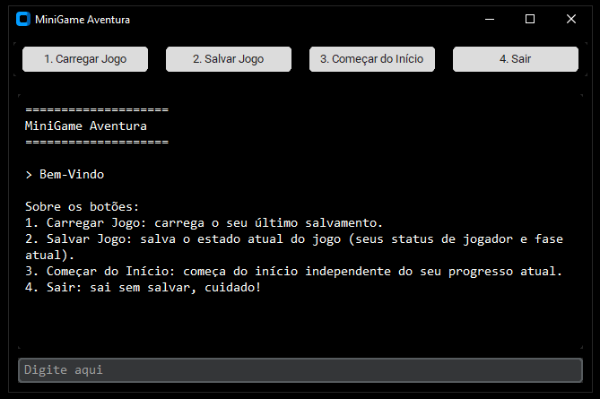
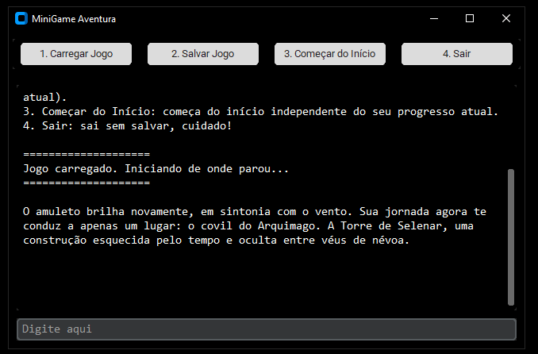
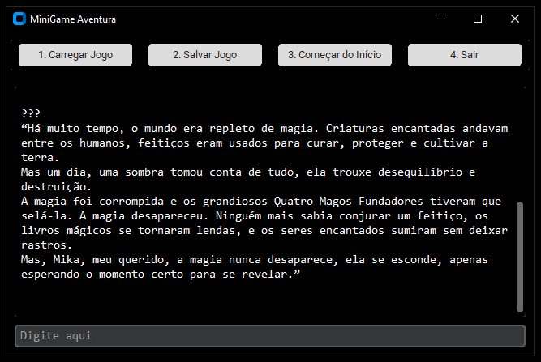
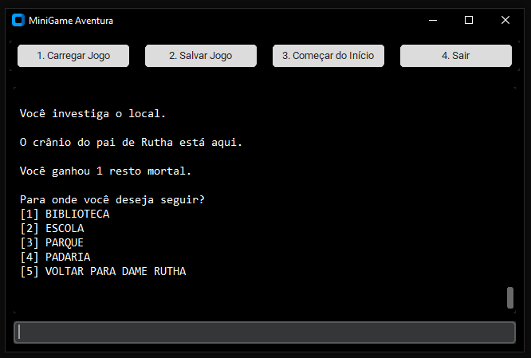

# MiniGame Aventura

## Tecnologias
Este projeto foi desenvolvido usando as seguintes tecnologias:
- Python
- CustomTkinter

## Projeto
Este projeto foi desenvolvido com base no curso de Programação em Python, administrado pelo professor Caio Ribeiro. Esta aplicação consiste em um jogo simples de aventura, em que o usuário controla o personagem principal "Mika".

Na tela inicial já aparecem 4 botões: "Carregar Jogo", "Salvar Jogo", "Começar do Início" e "Sair".

Se você já tem um jogo salvo, pode carregá-lo clicando em "Carregar Jogo", caso contrário, começe do início clicando em "Começar do Início".

Ao decorrer do jogo você pode salvar seu progresso clicando em "Salvar Jogo".

Caso queira sair, apenas clique em "Sair".

## Sinopse
Você é Mika, um andarilho solitário que cresceu ouvindo histórias mágicas contadas por sua avó, apenas lendas, curiosidades de um passado inalcançável. Ela lhe deu um amuleto antigo e disse: "Antigamente, acreditavam que este amuleto mostra o caminho"

## Telas
| Tela Inicial | Carregar Jogo |
| ---  | --- |
|  |  |

| Começar do Início | Durante o Jogo |
| ---  | --- |
|  |  |